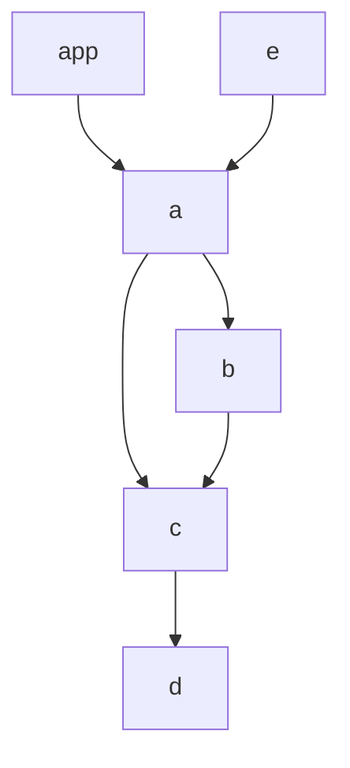

# Ghost testing example with Github Workflows

This [Modular](modular.js.org) monorepository has this graph of inter-workspace dependencies:



and a [Github workflow](https://github.com/cristiano-belloni/modular-ghost-testing-monorepo/blob/master/.github/workflows/ghost-test.yml) triggered by PRs to the `master` branch that invokes [`modular test`](https://modular.js.org/commands/test/) with the following options:

1. `--changed` (test only changed workspaces)
2. `--ancestors` (test only ancestors of changed workspaces)
3. `--compareBranch` (use specified branch as base for comparison, in our case `{{github.event.pull_request.base.ref}}`, the PR base according to Github).

This means that, for every open PR, tests will be selectively executed only on:

1) workspaces containing changed files compared to the base branch 
2) workspaces that (directly or indirectly) depend on them.

For example, [this pull request](https://github.com/cristiano-belloni/modular-ghost-testing-monorepo/pull/2) modifies one file in workspace `b`. This means that [our `ghost-test` workflow](https://github.com/cristiano-belloni/modular-ghost-testing-monorepo/blob/master/.github/workflows/ghost-test.yml) will run tests for:

1. workspace `b` (because one file has changed compared to the base branch)
2. workspace `a` (because it directly depends on `b`)
3. workspaces `e` and `app` (because they depend on `a`, indirectly depending on `b`)

Compare to [this workflow run on the PR](https://github.com/cristiano-belloni/modular-ghost-testing-monorepo/runs/8158149222?check_suite_focus=true), summarized below:

```
PASS test packages/app/src/__tests__/App.test.tsx
PASS test packages/a/src/__tests__/index.test.ts
PASS test packages/e/src/__tests__/index.test.ts
PASS test packages/b/src/__tests__/index.test.ts

# ...

Ran all test suites matching /packages\/a|packages\/app|packages\/e|packages\/b/i.
Done in 4.14s.
```
