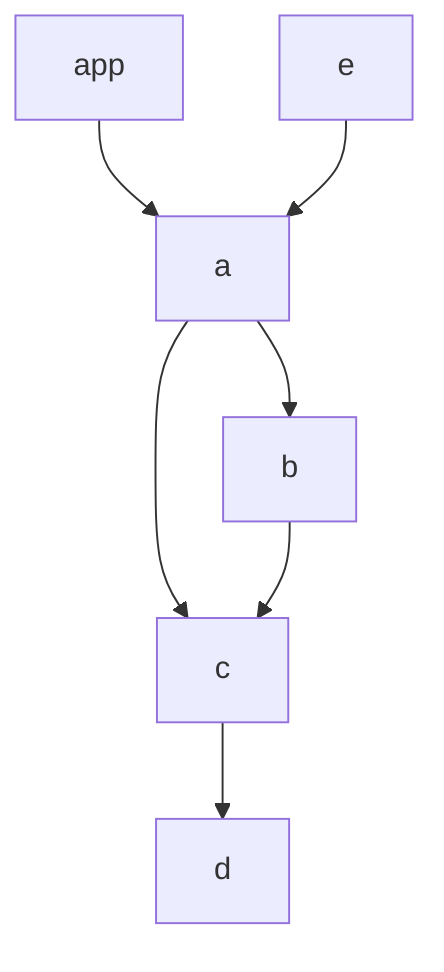

# Ghost testing example with Github Workflows

This [Modular](modular.js.org) monorepository has this graph of inter-workspace dependencies:



and a [Github workflow](https://github.com/cristiano-belloni/modular-ghost-testing-monorepo/blob/master/.github/workflows/ghost-test.yml) that invokes [`modular test`](https://modular.js.org/commands/test/) with the options `--changed` (test only changed workspaces), `--ancestors` (test only ancestors of changed workspaces) and `--compareBranch` (use specified branch as base, in our case `github.event.pull_request.base.ref`, the PR base according to Github) on open PRs.

This means that, for every open PR, tests will selectively be executed only on workspaces containing changed files and the workspaces that (directly or indirectly) depend on them.

For example, [this pull request](https://github.com/cristiano-belloni/modular-ghost-testing-monorepo/pull/2) modifies one file in workspace `b`. This means that Modular will execute tests in CI for workspace `b` (because it has modifications), workspace `a` (because it directly depends on `b`), and workspaces `e` and `app` (because they depend on `a`, indirectly depending on `b`), like in [this test run](https://github.com/cristiano-belloni/modular-ghost-testing-monorepo/runs/8158149222?check_suite_focus=true) summarized below:

```
PASS test packages/app/src/__tests__/App.test.tsx
PASS test packages/a/src/__tests__/index.test.ts
PASS test packages/e/src/__tests__/index.test.ts
PASS test packages/b/src/__tests__/index.test.ts

# ...

Ran all test suites matching /packages\/a|packages\/app|packages\/e|packages\/b/i.
Done in 4.14s.
```
